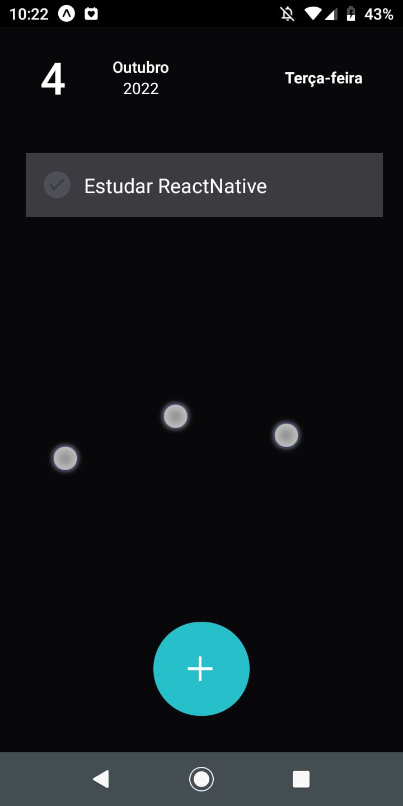
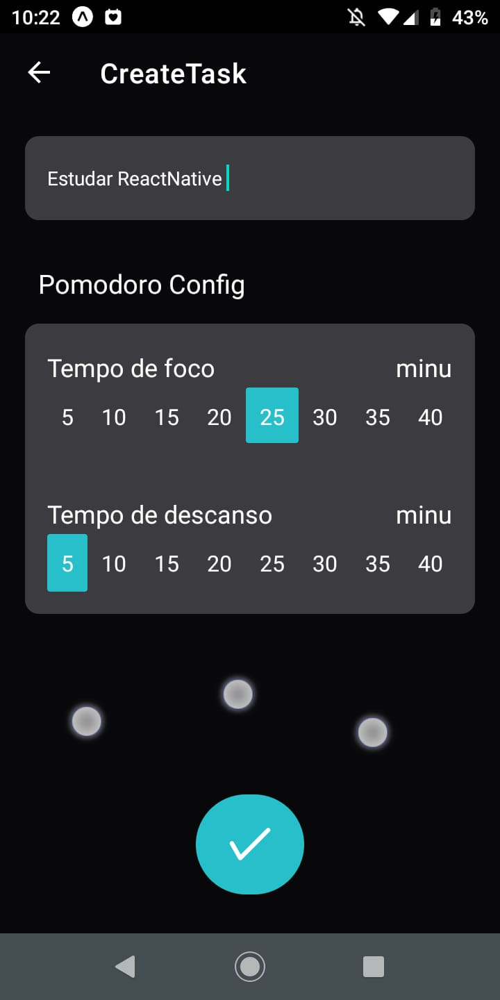
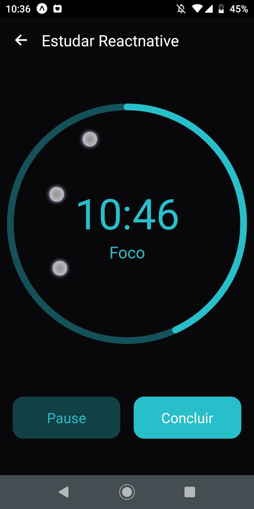
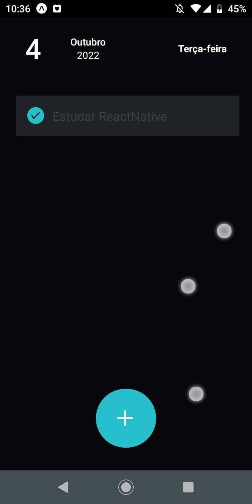

## Pomodoro To Do List
Um pomodoro junto com to do list em só um app. Com um design fácil e prático para agilizar a produtividade do usuário. Aplicação desenvolvida em React Native + TypeScript + Firebase.

## Tecnologias
>
Aqui está as tecnologias usadas no projeto

 - expo ~46.0.9
 - react-native 0.69.6
 - react-native-circular-progress-indicator ^4.4.0
 - styled-components ^5.3.5
 - firebase 9.8
 - typescript ~4.3.5
 
 ## Serviços usados
  - github

## Como usar

### 1 - Home
  

### 2 - Nova Tarefa
  

### 3 - Pomodoro
  

### 4 - Tarefa Concluída
  

## Funcionalidades

As principais funcionalidades são:
 - Criar tarefa
 - Deletar tarefa
 - Cronometrar

## Links
 - Repositório: https://github.com/Vinicius-B-Leite/pomodore-to-do-list
 - Em casos de bugs, por favor me contate
  viniciusbleite21@gmail.com

## Versão
 1.0.0

## Autor
Feito com <3 por Vinicius B. Leite